# ⚡ Automatización de Redes con Ansible

Automatización de la configuración de dispositivos Cisco IOS mediante Ansible utilizando un servidor Ubuntu Server, acceso remoto con Visual Studio Code Remote SSH y conectividad segura mediante ZeroTier.

---

# 📌 Descripción del Proyecto

Este proyecto consiste en la automatización de tareas de administración de redes Cisco utilizando Ansible como herramienta de gestión de configuraciones.

El entorno fue implementado sobre un servidor Ubuntu Server que actúa como nodo de control (Control Node), desde donde se ejecutan playbooks para administrar un router Cisco IOS mediante el protocolo SSH.

El desarrollo fue realizado de forma colaborativa entre dos integrantes ubicados en diferentes sitios, utilizando ZeroTier para establecer una VPN privada y Visual Studio Code Remote SSH para trabajar simultáneamente sobre el mismo servidor.

---

# 🎯 Objetivos del Proyecto

Automatizar la configuración de dispositivos Cisco IOS para:

- Reducir errores de configuración.
- Estandarizar despliegues.
- Facilitar la administración remota.
- Implementar Infraestructura como Código (IaC).
- Mejorar el trabajo colaborativo mediante acceso remoto.

---

# 🚀 Tecnologías Utilizadas

- Ubuntu Server 22.04 LTS
- Ansible
- Python 3
- Cisco IOS
- OpenSSH Server
- Visual Studio Code
- Remote SSH Extension
- ZeroTier One
- Git
- GitHub
- YAML

---

# 🧠 Funcionalidades Implementadas

Actualmente el proyecto permite:

## Administración de Equipos Cisco
    Configuración automática de interfaces mediante Ansible.
    Configuración de dirección IP.
    Configuración de hostname.
    Configuración de usuarios.
    Configuración de SSH.
    Configuración de NTP.
    Ejecución remota de comandos IOS.
    Automatización mediante Playbooks.

## Automatización con Python
    Conexión SSH al router.
    Generación automática de respaldos (backup.py).
    Validación de la configuración del router (validar_red.py).
    Generación de reporte JSON (reporte.py).

## Automatización con Bash
    Ejecución centralizada de los scripts del proyecto mediante ejecutar.sh.

## Administración del Servidor
    Gestión remota mediante SSH.
    Organización del inventario Ansible.
    Administración del router Cisco desde Ubuntu Server.

## Trabajo Colaborativo
Acceso simultáneo mediante Visual Studio Code Remote SSH.
Conectividad privada mediante ZeroTier.
Administración remota del servidor Ubuntu.

---

# 📡 Arquitectura del Proyecto

```text
                     Internet
                         │
                  ZeroTier VPN
                         │
        ┌──────────────────────────────────┐
        │                                  │
  Integrante 1                      Integrante 2
 Visual Studio Code               Visual Studio Code
     Remote SSH                     Remote SSH
        │                                  │
        └────────────── SSH ───────────────┘
                         │
                  Ubuntu Server
                  (Control Node)
                         │
                      Ansible
                         │
                     SSH (Puerto 22)
                         │
                 Router Cisco IOS
```

---

# 📂 Estructura del Proyecto

```text
Evaluacion4/
│
├── ansible/
│   ├── ansible.cfg
│   ├── inventory.ini
│   ├── playbook_base.yml
│   ├── playbook_interfaces.yml
│   └── vars.yml
│
├── python/
│   ├── conexion.py
│   ├── backup.py
│   ├── validar_red.py
│   └── reporte.py
│
├── bash/
│   └── ejecutar.sh
│
├── backups/
│
├── reportes/
│   └── reporte.json
│
├── docs/
│
├── evidencias/
│
└── README.md
```

---

# ⚙️ Requisitos

## Software

- Ubuntu Server 22.04
- Python 3
- Ansible
- OpenSSH Server
- Cisco IOS
- Visual Studio Code
- Remote SSH Extension
- ZeroTier One

---

# 📋 Instalación

## Actualizar Ubuntu

```bash
sudo apt update
sudo apt upgrade -y
```

---

## Instalar Ansible

```bash
sudo apt install ansible -y
```

Verificar instalación

```bash
ansible --version
```

---

## Instalar colección Cisco IOS

```bash
ansible-galaxy collection install cisco.ios
```

Verificar

```bash
ansible-galaxy collection list
```

---

# 🔐 Configuración SSH

Verificar que el servicio SSH esté activo

```bash
sudo systemctl status ssh
```

Reiniciar servicio

```bash
sudo systemctl restart ssh
```

Verificar conectividad

```bash
ssh usuario@IP_DEL_SERVIDOR
```

---

# 🌐 Configuración ZeroTier

1. Instalar ZeroTier.
2. Unirse a la red privada.
3. Autorizar el dispositivo desde ZeroTier Central.
4. Verificar la IP asignada.

Comprobar interfaz

```bash
ip a
```

---

# 📂 Configuración del Inventario

Ejemplo de `inventory.ini`

```ini
[cisco]

Router1 ansible_host=192.168.10.1

[cisco:vars]

ansible_user=cisco
ansible_password=cisco123
ansible_connection=network_cli
ansible_network_os=cisco.ios.ios
ansible_port=22
```

---

# 🚀 Ejecución de Playbooks

Verificar sintaxis

```bash
ansible-playbook playbook_interfaces.yml --syntax-check
```

Ejecutar playbook

```bash
ansible-playbook playbook_interfaces.yml
```

---

# ✔️ Verificaciones

## Comprobar conexión con Ansible

```bash
ansible cisco -m ping
```

---

## Mostrar versión de Cisco IOS

```bash
ansible Router1 -m cisco.ios.ios_command -a "commands='show version'"
```

---

## Mostrar interfaces del Router

```bash
ansible Router1 -m cisco.ios.ios_command -a "commands='show ip interface brief'"
```

---

## Mostrar configuración en ejecución

```bash
ansible Router1 -m cisco.ios.ios_command -a "commands='show running-config'"
```

---

## Ejecutar respaldo automático

```bash
cd python
python3 backup.py
```

---

## Validar la configuración de la red

```bash
cd python
python3 validar_red.py
```

---

## Generar reporte en formato JSON

```bash
cd python
python3 reporte.py
```

---

## Ejecutar todas las automatizaciones mediante Bash

```bash
chmod +x bash/ejecutar.sh
./bash/ejecutar.sh
```

---

# 💻 Trabajo Colaborativo

El proyecto fue desarrollado por dos integrantes ubicados en diferentes lugares.

## Integrante 1

Responsabilidades:

- Instalación de Ubuntu Server.
- Configuración de Ansible.
- Configuración del Router Cisco.
- Desarrollo de Playbooks.

## Integrante 2

Responsabilidades:

- Instalación de Visual Studio Code.
- Configuración Remote SSH.
- Configuración ZeroTier.
- Pruebas de funcionamiento.
- Documentación del proyecto.

---

---

# 📷 Evidencias del Proyecto

A continuación se presentan las principales evidencias del desarrollo e implementación del proyecto.

## 1. Creación del servidor Ubuntu

**Creación de la máquina virtual Ubuntu Server**


---

## 2. Actualización del sistema

**Actualización de paquetes del servidor Ubuntu**

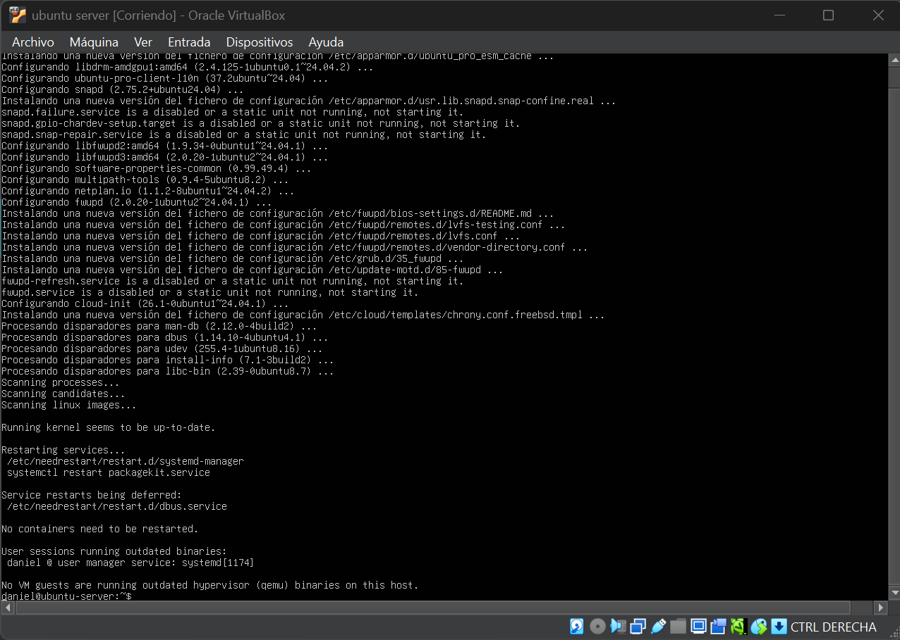

---

## 3. Instalación y configuración de OpenSSH

**Instalación del servidor OpenSSH**

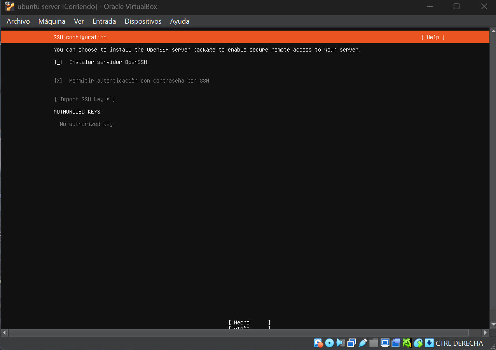

**Servicio OpenSSH activo**


---

## 4. Configuración de ZeroTier

**Creación de la red privada**

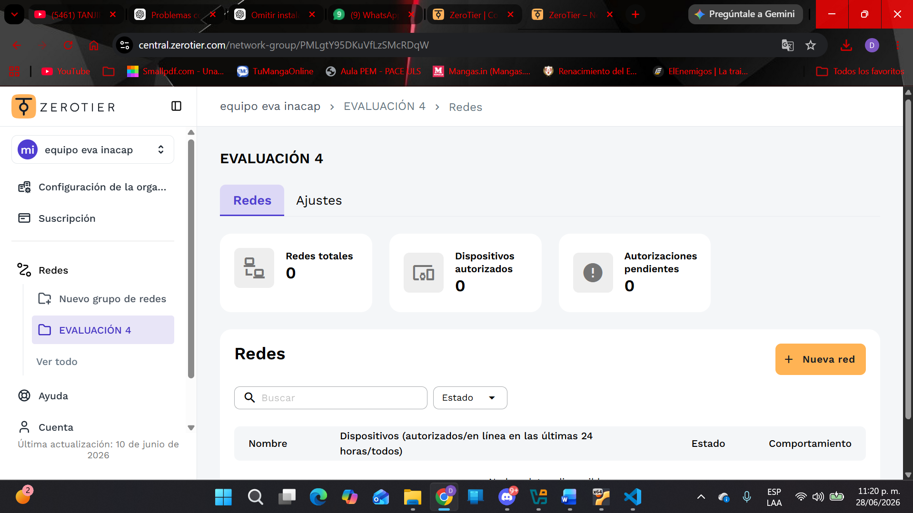

**Servidor Ubuntu autorizado**

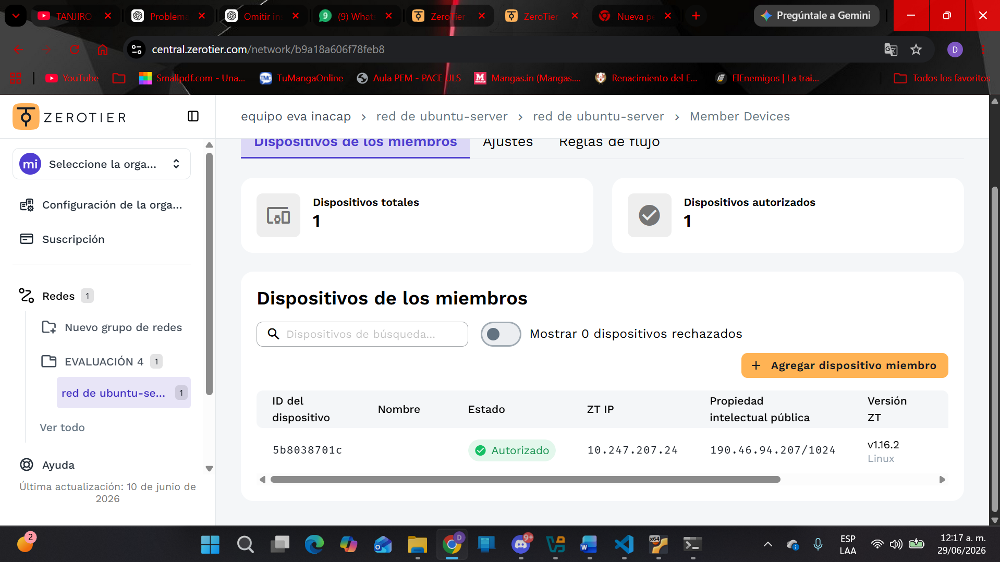

**Autorización de los equipos**

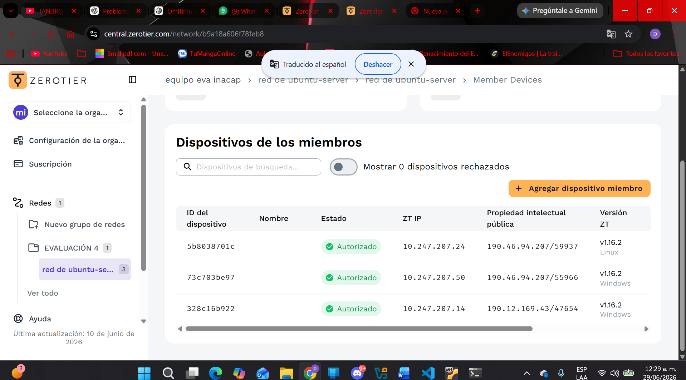

**ZeroTier conectado correctamente**

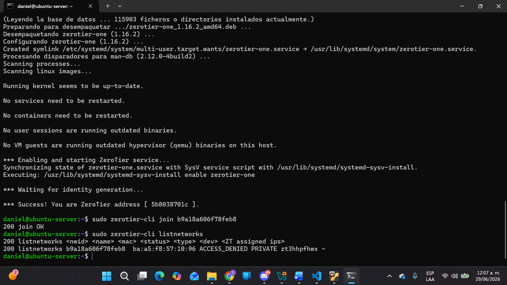

---

## 5. Estructura del proyecto

**Organización del proyecto en Visual Studio Code**

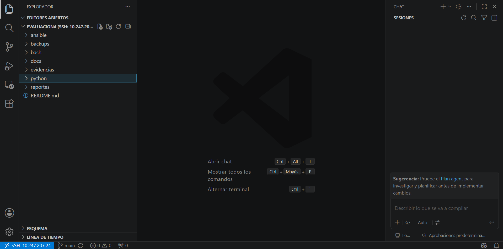

---

## 6. Automatización con Ansible

**Ejecución del playbook de configuración base**


**Ejecución del playbook de interfaces**


---

## 7. Desarrollo de scripts en Python

**Archivos desarrollados**

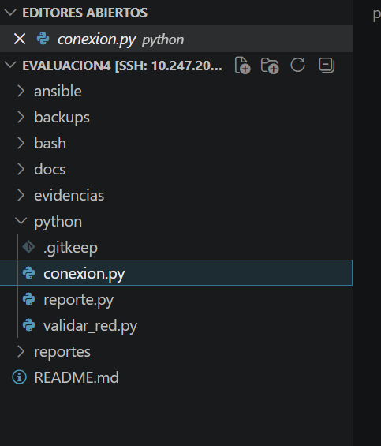

**Código de conexión al router**

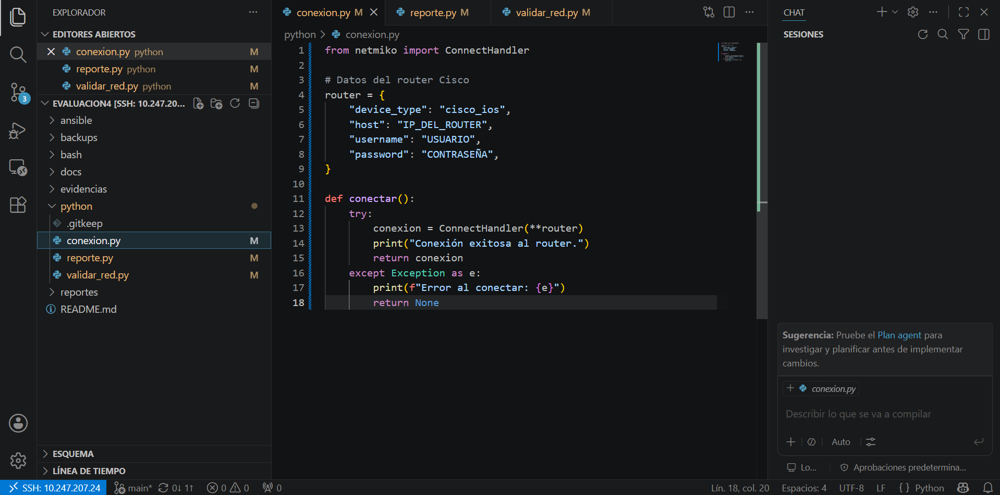

**Código del reporte JSON**

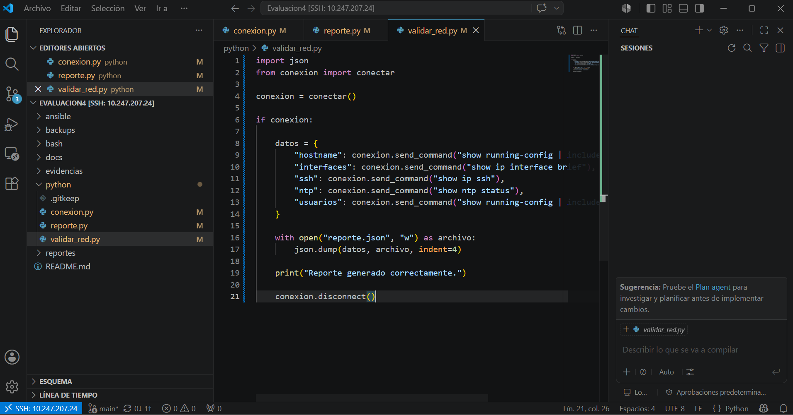

**Código actualizado del reporte**

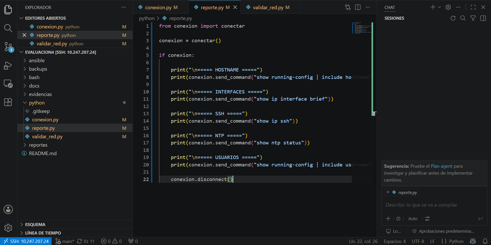

---

## 8. Ejecución de scripts

**Generación automática del backup**

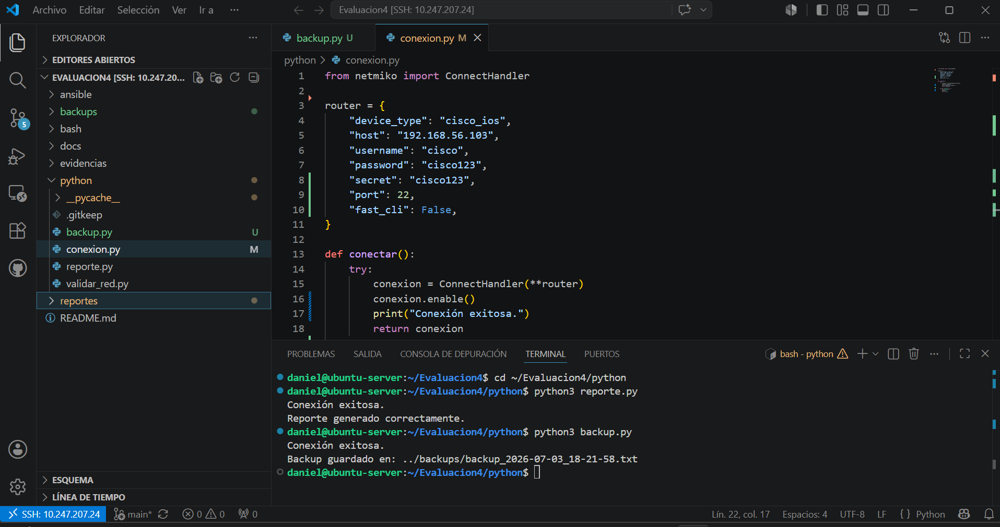

**Validación automática de la red**


**Automatización mediante Bash**

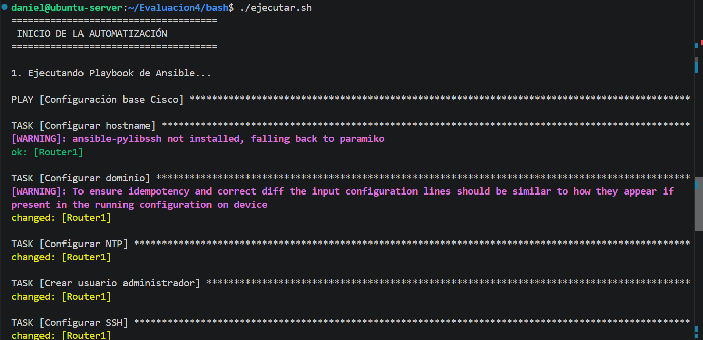

---

## 9. Resultados obtenidos

**Contenido del archivo de backup**

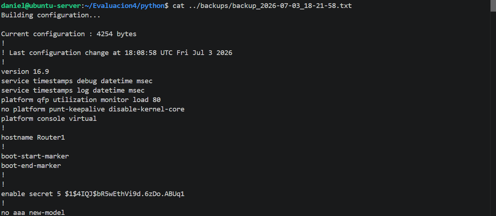

**Contenido del reporte JSON**

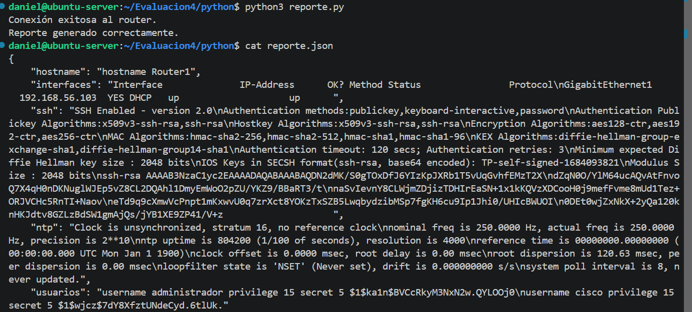

**Visualización del archivo JSON**

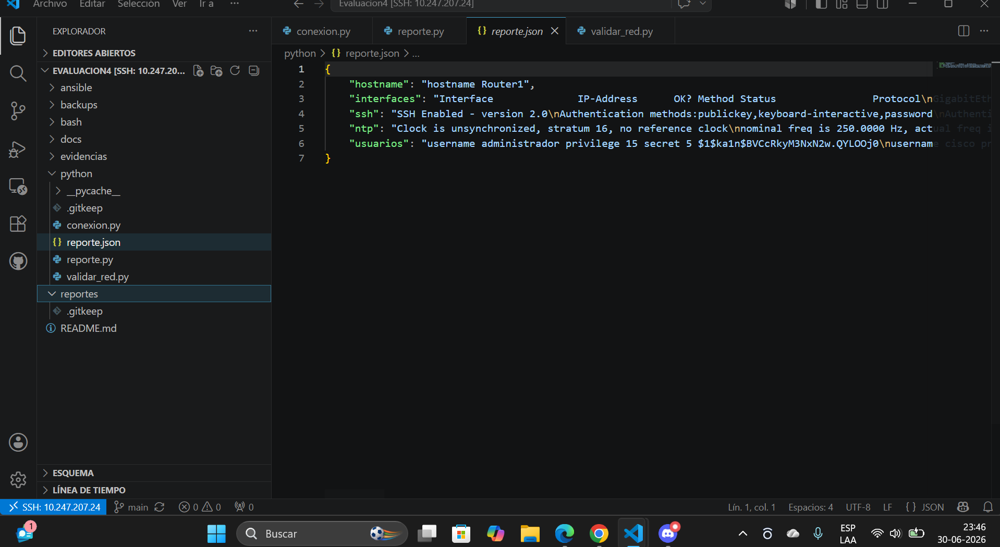

---

## 10. Administración del Router Cisco

**Visualización de la configuración del router**

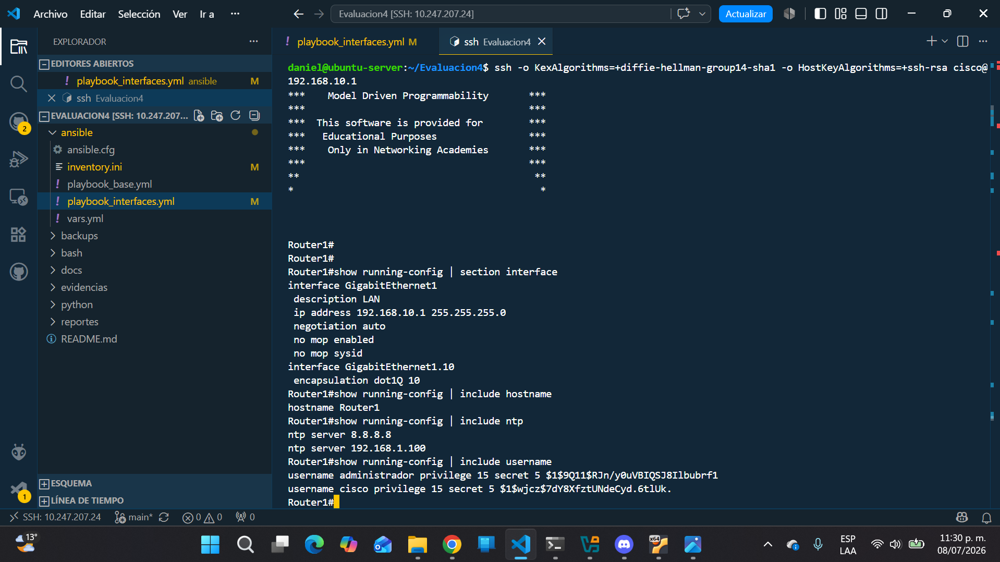

**Funcionamiento del router Cisco**

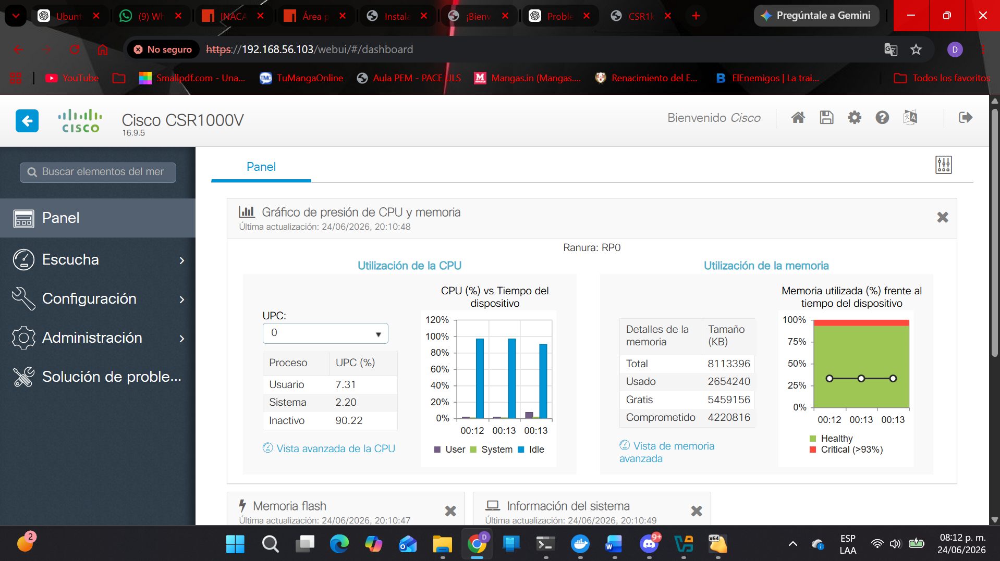

---

## 11. Automatización mediante Bash

**Permisos de ejecución del script**


**Salida completa del script**

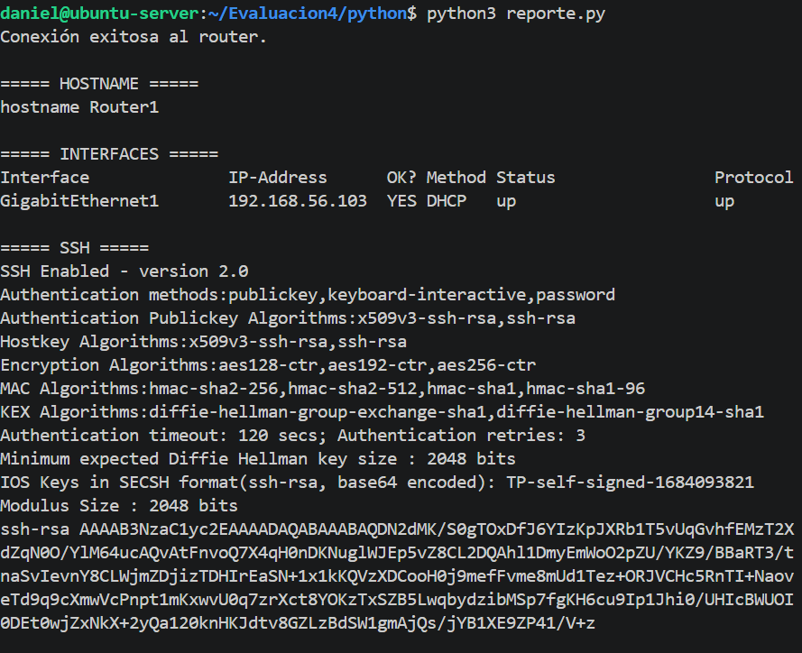

---


# 📋 Comandos Utilizados

Actualizar sistema

```bash
sudo apt update
```

Mostrar IP

```bash
ip a
```

Ver rutas

```bash
ip route
```

Estado SSH

```bash
sudo systemctl status ssh
```

Probar conectividad

```bash
ping 192.168.10.1
```

Ingresar al router

```bash
ssh cisco@192.168.10.1
```

---

# 📁 Archivos Principales

| Archivo                 | Descripción                             |
| ----------------------- | --------------------------------------- |
| ansible.cfg             | Configuración de Ansible                |
| inventory.ini           | Inventario de dispositivos              |
| playbook_base.yml       | Configuración base del router           |
| playbook_interfaces.yml | Configuración automática de interfaces  |
| conexion.py             | Establece la conexión SSH con el router |
| backup.py               | Genera un respaldo de la configuración  |
| validar_red.py          | Verifica el estado del router           |
| reporte.py              | Genera un reporte JSON                  |
| ejecutar.sh             | Ejecuta las automatizaciones            |
| README.md               | Documentación del proyecto              |

---

# 🔄 Flujo de Trabajo

1. Iniciar Ubuntu Server.
2. Conectar ZeroTier.
3. Acceder mediante Remote SSH.
4. Abrir el proyecto en VS Code.
5. Ejecutar los playbooks.
6. Verificar la configuración aplicada.
7. Documentar los resultados.

---

# 📌 Estado Actual del Proyecto

## Funcionalidades Implementadas

- Instalación de Ubuntu Server.
- Configuración de SSH.
- Configuración de ZeroTier.
- Instalación de Ansible.
- Configuración del inventario.
- Automatización mediante Playbooks.
- Administración remota del Router Cisco.
- Trabajo colaborativo mediante VS Code Remote SSH.
- Documentación del proyecto.

---

# 📈 Resultados Obtenidos

Durante el desarrollo del proyecto se obtuvieron los siguientes resultados:

- Comunicación exitosa entre Ubuntu Server y el router Cisco IOS mediante SSH.
- Automatización de la configuración base del router utilizando Ansible.
- Ejecución de playbooks para administrar dispositivos Cisco.
- Desarrollo de scripts en Python para realizar respaldos automáticos.
- Validación automática de la configuración del router.
- Generación de reportes en formato JSON.
- Automatización de tareas mediante Bash.
- Trabajo colaborativo utilizando Visual Studio Code Remote SSH y ZeroTier.
- Documentación completa del proyecto mediante evidencias e imágenes.

---

# 👨‍💻 Autores

- **Daniel Videla**
- **Nicolás Bastidas**

---

# 📄 Licencia

Este proyecto fue desarrollado con fines académicos para la asignatura de Automatización de Redes.
